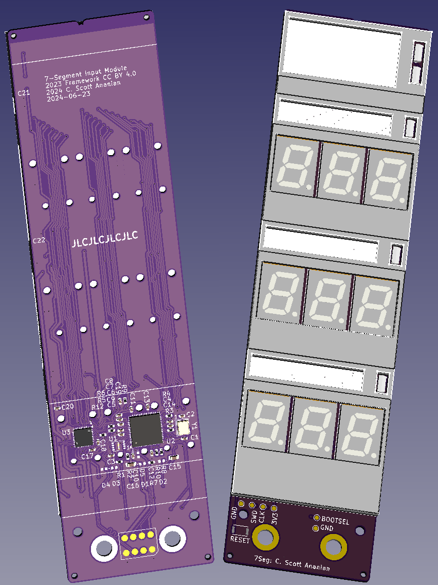

# Seven Segment Display Input Module

This module is based on the "34x9 LED Matrix" example
from https://github.com/FrameworkComputer/InputModules
and is powered by a Raspberry Pi RP2040 microcontroller.

A short video demo of first light from the prototype is at
https://youtu.be/MXg15aWYOqI

More discussion of this project can be found in the [Framework
forums](https://community.frame.work/t/showcase-7-segment-display-input-module/53807).

## License
Input Modules © 2023 by Framework Computer Inc is licensed under CC BY 4.0.

This seven segment display input module is © 2024 by
C. Scott Ananian and is also licensed under CC BY 4.0.

To view a copy of this license,
visit http://creativecommons.org/licenses/by/4.0/

## Fabrication and Assembly
A 0.8mm PCB is required.

Most components are SMT on the bottom side of the board; the
[seven segment displays](https://www.digikey.com/en/products/detail/vishay-semiconductor-opto-division/VDMR10A1/4327669)
and [side-firing neopixel LEDs](https://www.digikey.com/en/products/detail/adafruit-industries-llc/4691/13170955)
are on the top side.  If you use a PCBA service, it is most economical
to have the bottom side assembled and then hand-solder the small
number of top-side components.

In addition, the [threaded inserts](https://www.digikey.com/en/products/detail/keystone-electronics/24929/16343672) are not generally stocked by JLCPCB
and so are probably easier to hand assemble.

A bezel for the board, which can be 3d printed, can be found in
[LEDMatrix-cover-Body.step](./LEDMatrix-cover-Body.step).  This was
designed in FreeCad and the source is `LEDMatrix-cover.FCStd`.

It is intended that 4mil transparency be used to create legends
for the different sections of the display, and then the entire
top surface be covered with 0.2mm ND film to achieve a consistent
look.  A template for the legends is in
[LEDMatrix-template.pdf](./LEDMatrix-template.pdf) and sample
legends ready to print (or modify!) are in
[LEDMatrix-sample-legends.svg](./LEDMatrix-sample-legends.svg).